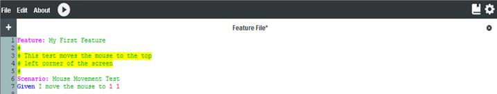

# Comments

Comments within a Cycle Script can greatly increase the readability of a script. Comments can be used to convey many different types of information, including the purpose of a Feature or Scenario, explanations of why a script was written a certain way, or special instructions for the users.

Any line in a script that begins with the # character is considered a comment. All text on a line that begins with a # character is ignored when the Feature or Scenario is executed. *Figure 1F* shows a comment positioned at the start of a Scenario. 

***Figure 1F:***

