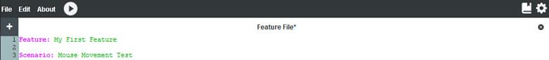

# Feature Files

Cycle testing scripts are stored in source files (called Feature Files) with a “.feature” extension. Every Feature File starts with a description to provide an overview of the Scenarios in a given source file. This description begins with the keyword “Feature:”.

Feature Files are the highest level grouping of test Scenarios and are used to group Scenarios that relate together. See *Figure 1B*.

***Figure 1B:***

