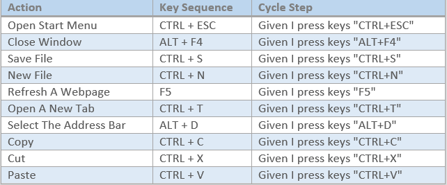

# Keyboard Steps and Shortcuts

Keyboard navigation and key sequences are often the most efficient and reliable way to interact with an application. Cycle includes many Steps for performing keyboard activities such as: entering text, pushing common buttons, pushing functions keys, entering multiple key sequences, and pushing a single key multiple times with waits in between.

The Windows operating system contains many keyboard shortcuts to allow actions to be invoked. *Figure 1E* displays many of the commonly used short-cuts. 

***Figure 1E:***

The website http://windows.microsoft.com/en-us/windows/keyboard-shortcuts contains a complete list of the Windows keyboard shortcuts.