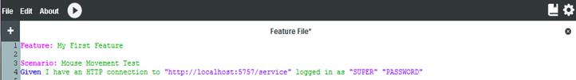

# Scenarios

Each Feature File is made up of one or more Scenarios. A Scenario is a list of actions and validations used to perform a test. Scenarios are defined by the “Scenario:” keyword, and most Scenarios will begin with the “Given” keyword to define the state of the application for each Scenario. Scenarios are independent of one another during Feature execution. See *Figure 1C*.

***Figure 1C:***
