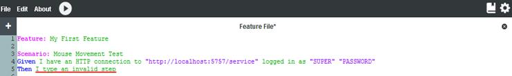

# Step Definitions

Each Step needs to have an associated Step Definition defined that actually implements the test described by the Step. A Step Definition defines the syntax of the Step, the arguments required to run the Step, and the Cycle activity that the Step invokes. The syntax of a Cycle Step is not case sensitive; however it does not allow extra blank spaces. Cycle comes with a set of predefined Step Definitions. Some of the standard Steps are specific to image comparison, mouse and keyboard manipulation, or even applications and database connections. Users can click on the book icon in the upper right corner of Cycle to view the pre-defined Steps Definitions.

If Cycle can’t match a given Step to a specific Step Definition, it will underline the problem Step to indicate there is an issue. See *Figure 1D*.

***Figure 1D:***
