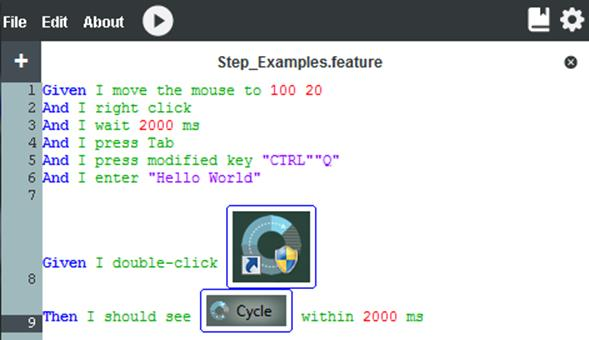

# Steps

A Step is an individual setting, action, or validation.

Scenarios consist of a set of Steps. Steps start with one of the defined Gherkin keywords such as Given, And, When and Then. These keywords have no actual functionality tied to them in terms of how Cycle parses and uses them, but they are used to ensure that the Scenarios are written with true behavior-driven development in mind.

Some examples of Steps include:

